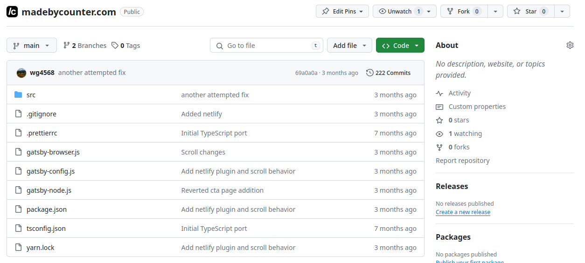
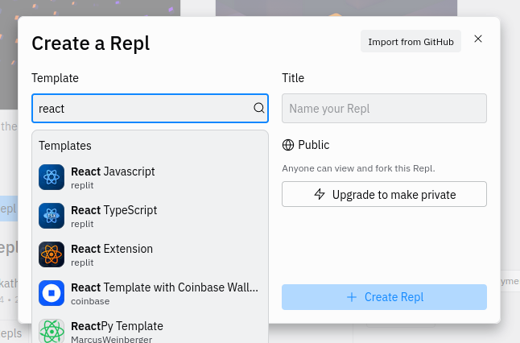
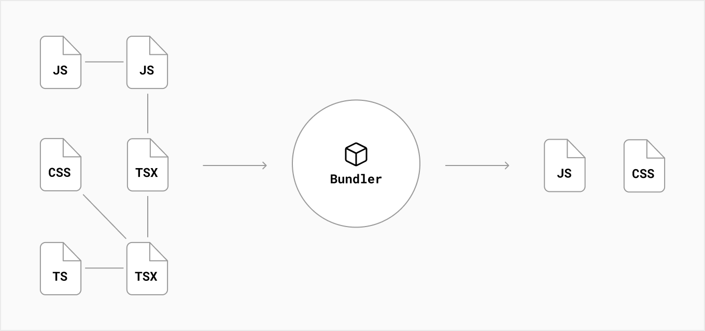

<style>
p, pre {
   font-size: 0.8rem;
}

section {
    padding: 1rem;
}
</style>

<!-- backgroundColor: white -->
<!-- _class: lead -->

# Intro to ReactJS

BHS Hackathon 2024
https://github.com/wg4568/bhs-hackathon-2024

---

# ReactJS is a **component based** framework for creating web applications.

---

# Traditional HTML Code

```html
<div>
    
    <h1>Jimmy John</h1>
</div>

<div>
    
    <h1>Sarah Smith</h1>
</div>
```

What happens if we want to change how a profile is displayed?

Imagine if we had 150 employees! Is this DRY code?

---

# ReactJS To The Rescue

```jsx
function Profile(props) {
    return <div>
        
        <h1>{props.name}</h1>
    </div>
}

function MyApp() {
    return <div>
        <Profile name="Jimmy John" profile="/jimmy.jpg" />
        <Profile name="Sarah Smith" profile="/sarah.jpg" />
    </div>
}
```

Now we can reuse our `Profile` component across our project.

---

# Thinking With Components



How might you break down this page into components?

---

# Getting Started



Navigate to https://replit.com/ and create an account. Then start a new project using the **React Javascript** template.

---

# HTML, in Javascript?!

Otherwise known as JSX, or **Javascript XML**.

Needs to be compiled, or "bundled" into standard Javascript code by a tool such as Vite or Webpack.



---

# Building Your Code

We are using [Vite](https://vitejs.dev/) as our bundler.

```json
    // From package.json
    "scripts": {
        "dev": "vite",
        "build": "vite build",
        "preview": "vite preview"
    },
```

We can run `npm run build` in the console to build our code.

Take a look in the new folder called `dist/`, what files have been created?

---

# Passing Values

We can pass data into React components using **props**.

```jsx
function Nametag(props) {
    return <h1>Written by {props.name}</h1>
}

function MyApp() {
    return <div>
        <Nametag name="Matt" />
    </div>
}
```

If you'd like, you can also get the value directly using deconstruction.

```jsx
function Nametag({ name }) {
    return <h1>Written by {name}</h1>
}
```

---

# Why Doesn't This Work?

```jsx
function MyCounter() {
    var count = 0;

    function increaseCount() {
        count = count + 1;
    }

    return <div>
        <p>The total is {count}</p>
        <button onClick={increaseCount}>Increase!</button>
    </div>
}
```

The answer is to do with how ReactJS handles **state**.

State is how an application remembers stuff.

---

# Managing State

ReactJS components manage their own state using **hooks**.

```jsx
function MyCounter() {
    const [count, setCount] = useState(0);

    function increaseCount() {
        setCount(count + 1);
    }

    return <div>
        <p>The total is {count}</p>
        <button onClick={increaseCount}>Increase!</button>
    </div>
}
```

The `useState` hook creates an object (that can be anything) and a function to update it's value. The value provided to `useState` is the initial value.

---

# Lists Of Various Things

Use Javascript's `.map` function to render arrays of elements.

```jsx
function ListOfAuthors() {
    const authors = ["Joe", "Amy", "Mike", "Megs"];

    return <div>
        {authors.map((name, index) => (
            <Author key={index} name={name} />
        ))}
    </div>
}
```

Whenever you are rendering lists of items, ReactJS requires a unique `key` value for each element. The easiest way to do this is to use the item index.

---

# User Input

The `onClick` property is used to catch when the user presses the submit button.

```jsx
function MyApp() {
    function showName() {
        // TODO: Get name from input box
        alert("Your name is ??");
    }

    return <div>
        <input type="text" placeholder="Enter your name">
        <button onClick={showName}>Submit!</button>
    </div>
}
```

Notice how we create a function to handle the event.

How do we get the value of the input box?

---

# References To HTML Elements

To get the value of our input box, we need a **reference**. References are created with the `useRef` hook.

```jsx
function MyApp() {
    const inputRef = useRef(null);

    function showName() {
        alert("Your name is " + inputRef.current.value);
    }

    return <div>
        <input ref={inputRef} type="text" placeholder="Enter your name">
        <button onClick={showName}>Submit!</button>
    </div>
}
```

We can use the `ref` property of the input box to it to the `inputRef` variable.

---

# A Brief Look At CSS

CSS in React can be done in *many* different ways. The easiest way is to create a regular css file and import it into your app.

```css
/* App.css */
.red {
    color: red;
}
```

```jsx
// App.jsx
import "./App.css"

function MyApp() {
    return <h1 className="red">I am red!</h1>
}
```

Notice how React uses `className` instead of `class` when specifying css classes.

---

# Next Steps

**Check out the code and slides from this lesson**
https://github.com/wg4568/bhs-hackathon-2024

**Setup a local dev environment**
https://www.youtube.com/watch?v=t5ffPXorFf4

**Read the ReactJS documentation**
https://react.dev/learn
